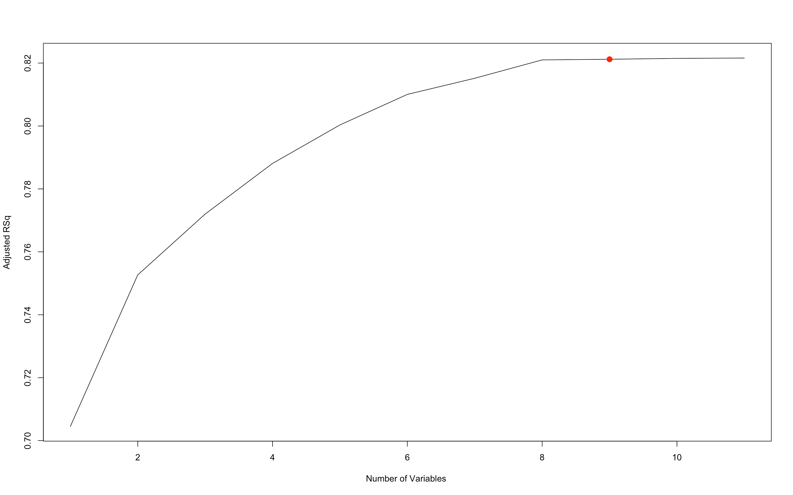
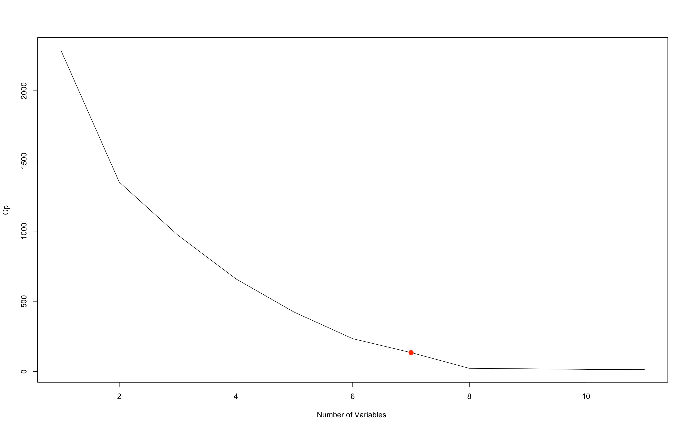
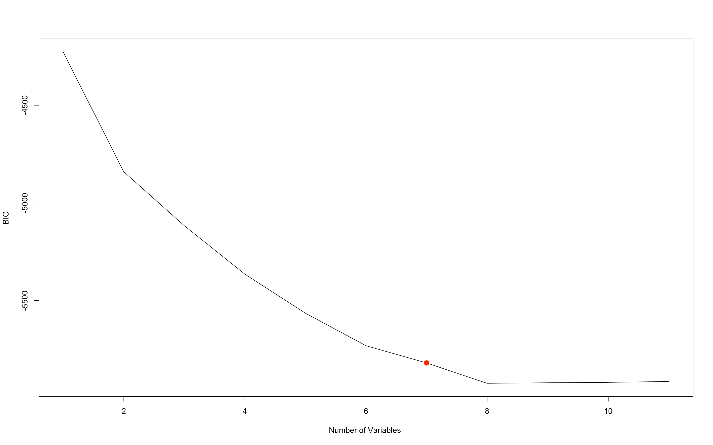
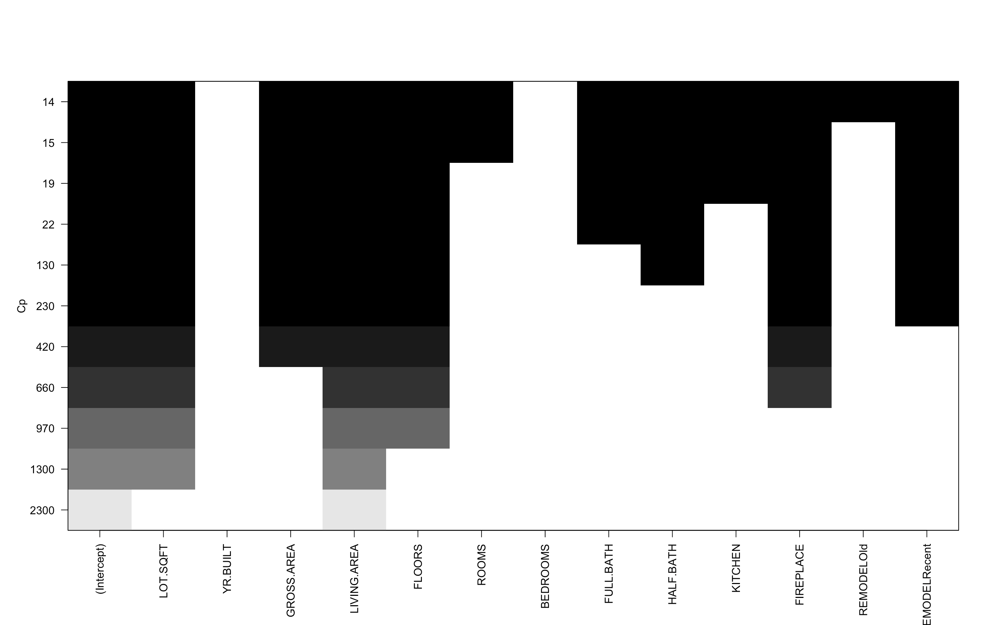
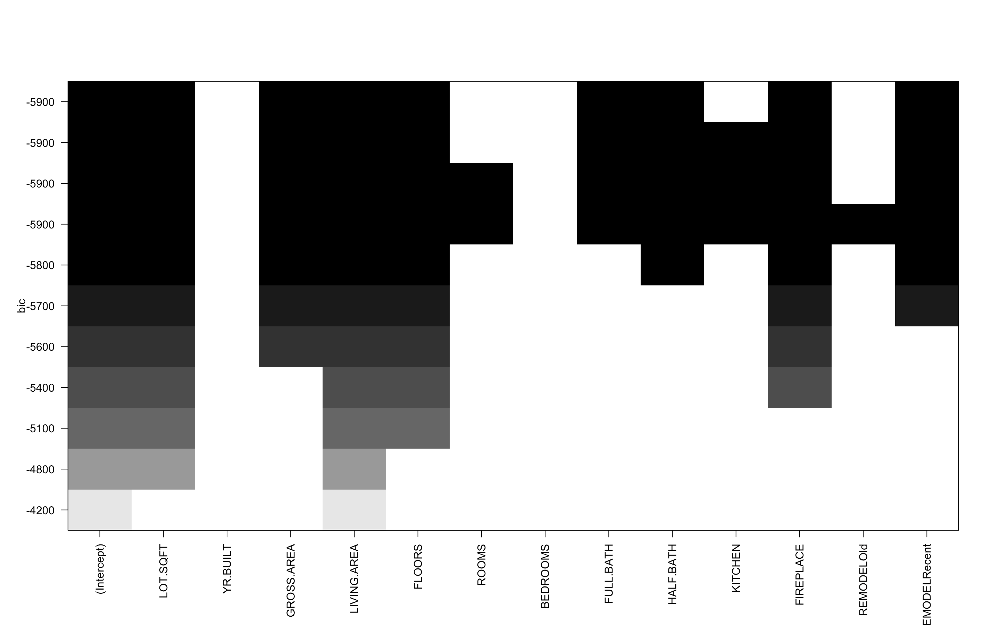
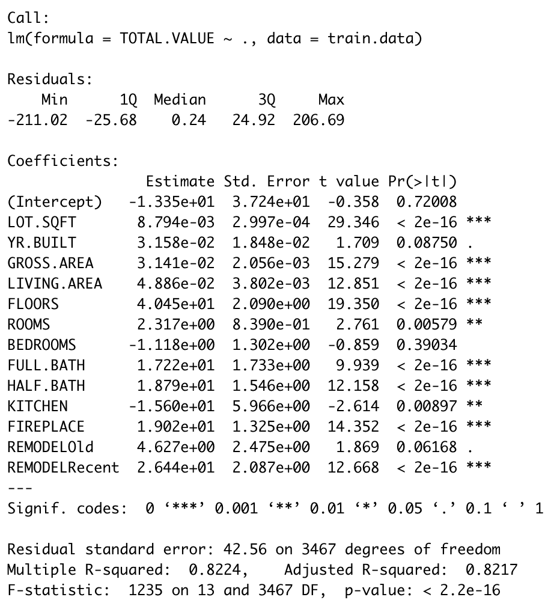
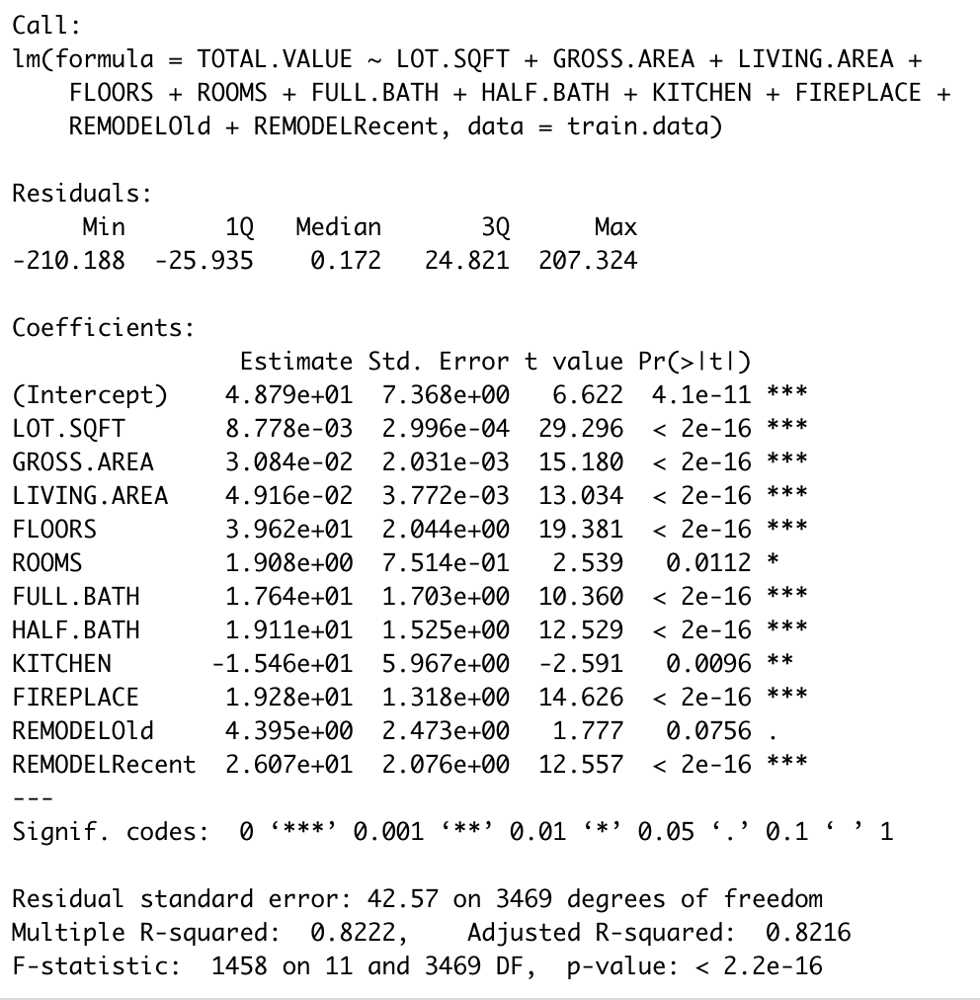
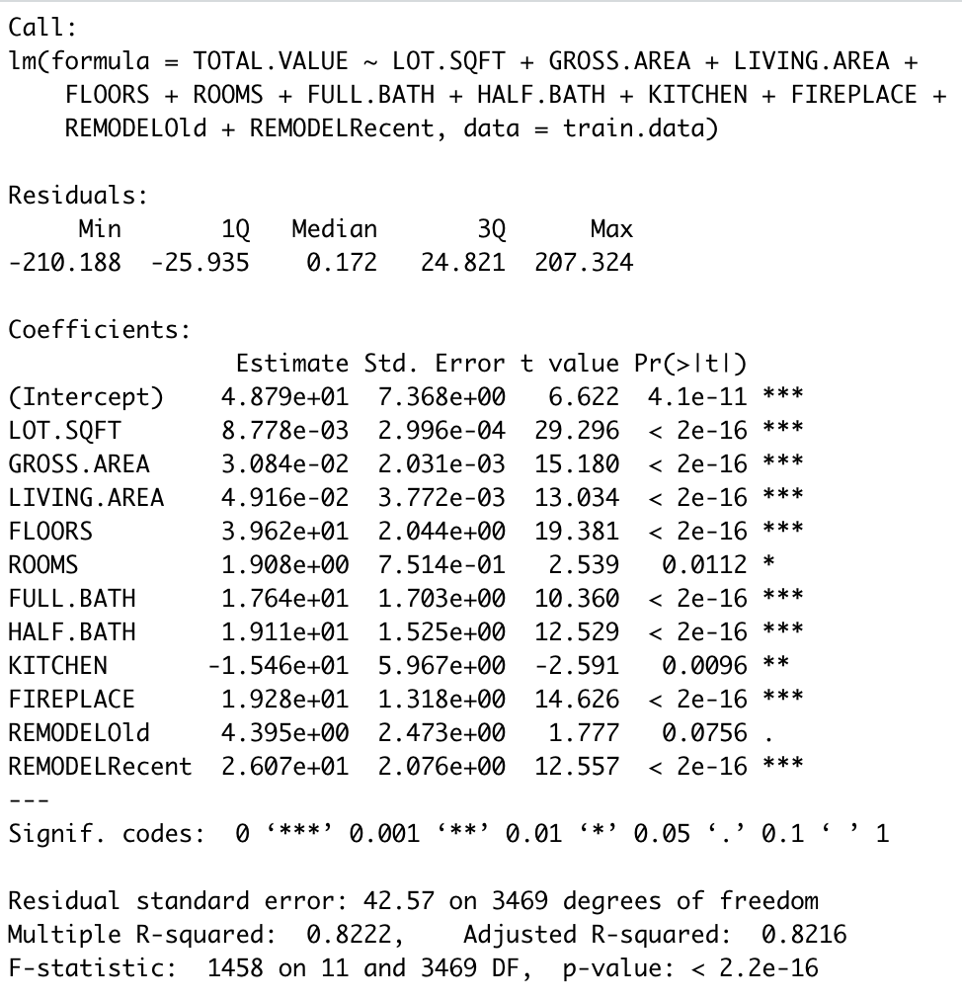
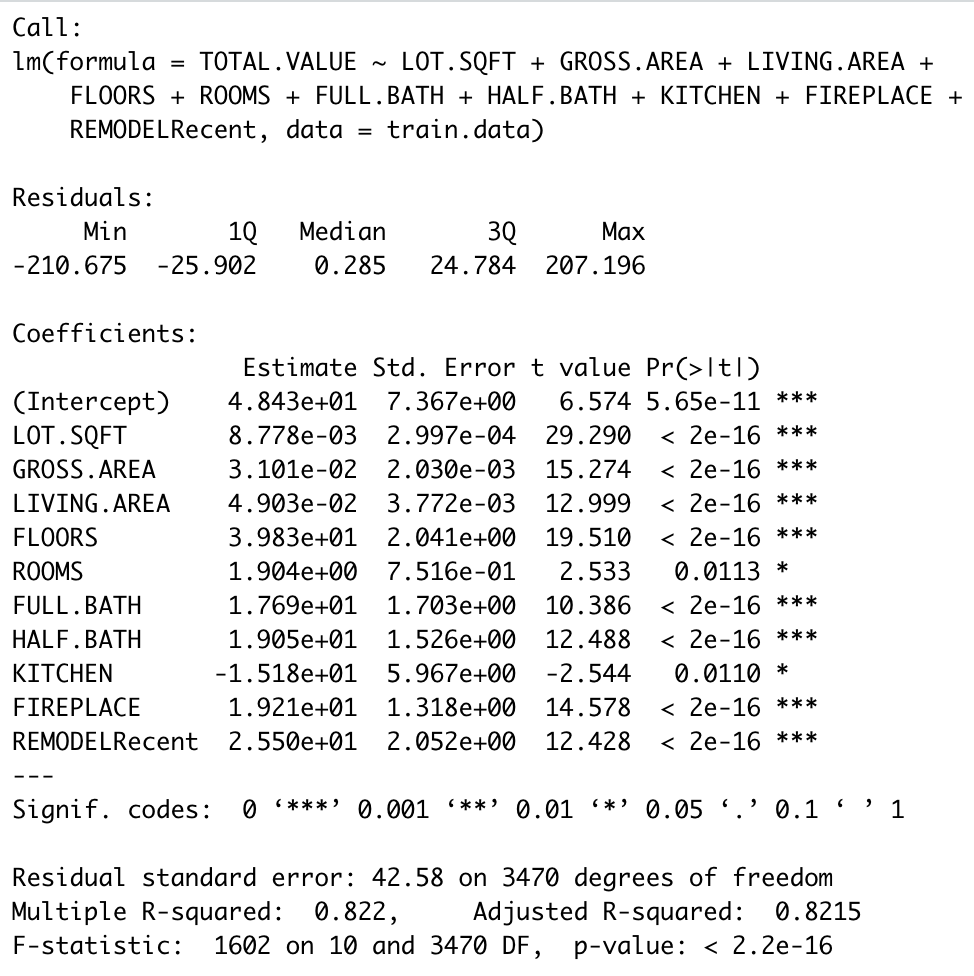
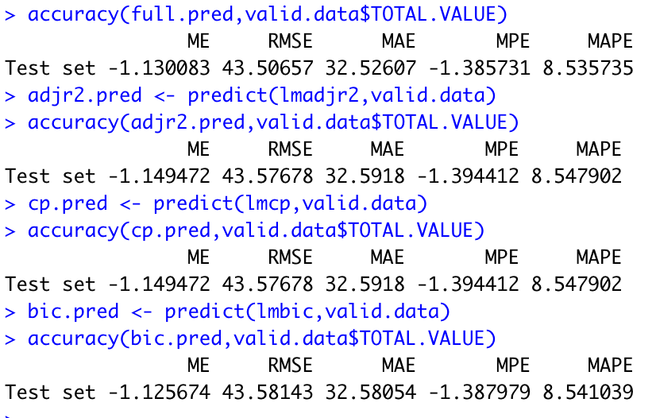

# Subset Selection
This aims to run a subset selection process on the data set. The target variable is TOTAL.VALUE. We partition the data on a 60:40 ratio.

## R2 Plot
R2 plot for different dimension sizes. Notice it is monotonically increasing and cannot be used to pick dimension size.

## Dimensions Selection
The plots of RSS, Adjusted RSq, Cp and BIC as a function of dimension.
The optimal dimension for the adjr2 model is 12.  

The optimal dimension for the Cp model is 10.

The optimal dimension for the BIC model is 9.

## Variable Selection
The variable selection plots for the adjr2, Cp, and BIC models

## Results

The adjr2 model drops the variables Bedrooms. 
The Cp model drops the variables Rooms, Bedrooms, Remodelold. 
The BIC model drops the variables Rooms, Bedrooms, Kitchen, Remodelold.

## Results for various models

## Final Prediction using the validation dataset

Therefore the best subset model is the Cp model. It has the lowest RMSE, MAE, and MAPE. It contains the explanatory variables LOT.SQRT, YR.BUILD, GROSS.AREA, LIVING.AREA, FLOORS, FULL.BATH, HALF.BATH, KITCHEN, FIREPLACE, REMODELRecent(i.e. leaves out ROOMS, BEDROOMS, REMODELOld). 
