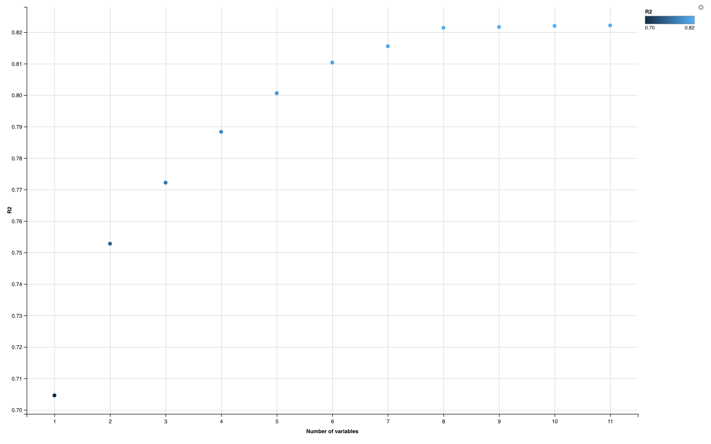

# Subset Selection
This aims to run a subset selection process on the data set. The target variable is TOTAL.VALUE.

## R2 Plot
R2 plot for different dimension sizes. Notice it is monotonically increasing and cannot be used to pick dimension size.

The reg.summary$adjr2, regsummary$cp, and reg.summary$bic results. They show you how these measures change with dimension.

The plots of RSS, Adjusted RSq, Cp and BIC as a function of dimension.

The variable selection plots for the adjr2, Cp, and BIC models

## Results

The adjr2 model drops the variables Bedrooms. 
The Cp model drops the variables Rooms, Bedrooms, Remodelold. 
The BIC model drops the variables Rooms, Bedrooms, Kitchen, Remodelold.

Results for various models

Final Prediction using the validation dataset
